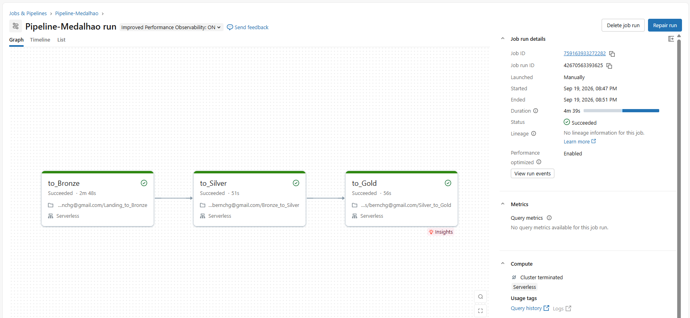

# CineData Analytics, Arquitetura Medalhao

Projeto desenvolvido para a atividade de Engenharia de Dados do RocketLab. A solucao implementa um pipeline end-to-end para preparar um catalogo de filmes baseado em dados TMDB/IMDb e disponibiliza-lo para analises de negocio, modelagem dimensional e uso por um assistente de Inteligencia Artificial.

## Autor

**Bernardo Heuer**  
[bernardoheuer2005@gmail.com](mailto:bernardoheuer2005@gmail.com)

## Sobre o projeto

Os dados de filmes sao entregues em arquivos CSV com inconsistencias de formato, tipos, separadores, valores ausentes, duplicidades e deslocamentos de colunas. O projeto organiza esses dados em um Lakehouse no Databricks, aplicando a Arquitetura Medalhao:

```text
Arquivos CSV + API PTAX do Banco Central
		v
	Bronze: dados brutos
		v
	Silver: dados limpos e tipados
		v
	Gold: modelo dimensional, data marts e contexto para GenAI
```

O resultado permite consultar indicadores financeiros e de engajamento dos filmes, relacionar filmes a generos, pessoas, produtoras e avaliacoes, alem de gerar documentos textuais para indexacao em um banco vetorial.

## Arquitetura Medalhao

### Bronze

A camada Bronze preserva os dados na forma mais proxima possivel da origem. O notebook cria o catalogo `medalhao`, o schema `bronze` e o Volume `landing`, le os cinco arquivos CSV e grava as tabelas em formato Delta com a coluna de auditoria `ingestion_datetime`.

Tambem e realizada a ingestao da cotacao de compra do dolar pela API PTAX do Banco Central, utilizando widgets para informar as datas inicial e final:

- `bronze.tb_movies_info`
- `bronze.tb_movies_financials`
- `bronze.tb_movies_metrics`
- `bronze.tb_credits_and_tags`
- `bronze.tb_movies_reviews`
- `bronze.tb_cotacao_dolar`

### Silver

A camada Silver transforma os dados brutos em tabelas confiaveis para consumo analitico. Nessa etapa sao aplicados mapeamento de nomes para portugues, conversao segura de tipos, normalizacao de textos e status, tratamento de datas em multiplos formatos, limpeza de valores monetarios e deduplicacao pela ingestao mais recente.

Entre as regras implementadas estao:

- conversao de orcamento e receita para valores numericos validos;
- calculo de valores em BRL usando a cotacao do dolar;
- calculo de lucro e margem de lucro;
- validacao das notas e contagens de votos;
- preenchimento de comentarios vazios com `Sem comentario`;
- separacao de generos, pessoas e empresas em registros individuais;
- criacao de uma serie diaria de cotacao com preenchimento `forward fill` para dias sem cotacao.

Tabelas produzidas:

- `silver.tb_info_filmes`
- `silver.tb_financeiro_filmes`
- `silver.tb_metricas_engajamento`
- `silver.tb_avaliacoes_usuarios`
- `silver.tb_generos`
- `silver.tb_pessoas_empresas`
- `silver.tb_cotacao_dolar`

### Gold

A camada Gold organiza os dados para BI e para o time de IA em um modelo dimensional Star Schema. As chaves substitutas sao geradas com `row_number()` e as tabelas Delta sao persistidas no schema `gold`.

#### Dimensoes e fato

- `gold.dim_movies`: metadados principais dos filmes;
- `gold.dim_genres`: catalogo deduplicado de generos;
- `gold.dim_people`: atores, diretores e roteiristas;
- `gold.dim_companies`: produtoras e estudios;
- `gold.dim_reviews`: contagem e media das avaliacoes por filme;
- `gold.fact_movies_performance`: metricas financeiras e de engajamento, com grao de um registro por filme.

#### Tabelas-ponte

As tabelas-ponte resolvem os relacionamentos muitos-para-muitos sem duplicar o grao da fato:

- `gold.bridge_movie_genre`
- `gold.bridge_movie_person`
- `gold.bridge_movie_company`

#### Contexto para GenAI

A tabela `gold.gold_genai_movies_context` consolida, em texto corrido, titulo, ano, receita, orcamento, atores principais, diretor e sinopse. Esse documento pode ser usado como base para embeddings e indexacao no Vector Search de um assistente RAG.

## Orquestracao

O arquivo [`job.yaml`](job.yaml) define o Workflow do Databricks `Pipeline-Medalhao`, com dependencias explicitas entre as tarefas:

```text
to_Bronze -> to_Silver -> to_Gold
```

O Job utiliza compute serverless, permite uma execucao concorrente por vez e esta configurado para rodar diariamente as 06:00 no fuso `America/Sao_Paulo`.

### Evidencia de execucao

A imagem abaixo mostra a execucao bem-sucedida do Job e o encadeamento entre as tarefas exigido pela atividade:




Schedule configurado na imagem acima

## Tecnologias utilizadas

- **Databricks**: ambiente de execucao, Workflows, Unity Catalog e Volumes;
- **Apache Spark / PySpark**: leitura, transformacao, limpeza, joins e agregacoes;
- **Spark SQL**: criacao de catalogos, schemas, volumes e consultas analiticas;
- **Delta Lake**: persistencia das tabelas nas camadas Bronze, Silver e Gold;
- **Python**: orquestracao das transformacoes e integracao com a API;
- **API PTAX do Banco Central**: obtencao da cotacao de compra do dolar;
- **YAML**: definicao declarativa do Workflow do Databricks.


