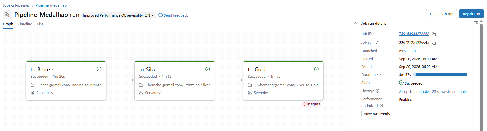
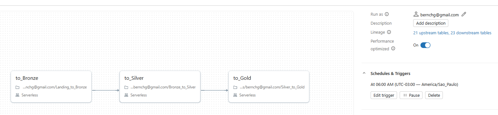

# CineData Analytics, Arquitetura Medalhão

Projeto da atividade de Engenharia de Dados do RocketLab (Visagio). Implementa um pipeline de dados end-to-end no Databricks para transformar um catálogo de filmes (TMDB/IMDb), entregue sujo e fragmentado em CSVs, em dados prontos para análise de negócio e para um assistente de IA.

**Autor:** Bernardo Heuer, [bernardoheuer2005@gmail.com](mailto:bernardoheuer2005@gmail.com)

## Objetivo

Estruturar os dados brutos de filmes seguindo a Arquitetura Medalhão (Bronze, Silver e Gold), gerando:

- um modelo dimensional (Star Schema) para consumo do time de BI;
- uma tabela de contexto textual para alimentar um Vector Search de um assistente RAG.

## Arquitetura Medalhão

- **Bronze**: ingestão dos 5 CSVs originais e da cotação do dólar (API PTAX do Banco Central) sem alterações, apenas com a coluna de auditoria `ingestion_datetime`.
- **Silver**: limpeza, tipagem, tradução de colunas para português, deduplicação, tratamento de datas/valores inconsistentes e normalização de gêneros, pessoas e produtoras.
- **Gold**: modelagem dimensional (fato + dimensões + tabelas-ponte) para BI, além da tabela `gold_genai_movies_context` com o texto consolidado por filme para o time de IA.

## Orquestração

O [`job.yaml`](job.yaml) define o Workflow `Pipeline-Medalhao` no Databricks com as tarefas `to_Bronze → to_Silver → to_Gold`, dependências explícitas e agendamento diário às 06:00 (`America/Sao_Paulo`).

### Execução do Pipeline

## Tecnologias utilizadas

- **Databricks** (Workflows, Unity Catalog, Volumes)
- **Apache Spark / PySpark**
- **Spark SQL**
- **Delta Lake**
- **Python**
- **API PTAX do Banco Central**
